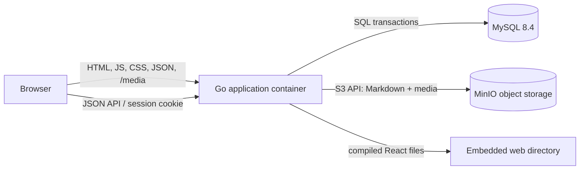

# Architecture

## System shape

B.C CMS is a modular monolith. React produces the public interface, the Go process owns authentication and all writes, MySQL is the transactional source of truth for metadata/search/access rules, and MinIO owns canonical document and media bytes through the S3 API.

The production image contains the compiled React assets and the Go binary. The browser never needs a third-party CDN or bucket credential. The Go server returns static application files and JSON, and proxies `/media/{key}` to the private bucket with Range support for video seeking.

## Bounded modules

| Module | Frontend | HTTP | Domain/store | Tables |
| --- | --- | --- | --- | --- |
| Content | `ContentHub`, `ArticleReader`, publisher | `/api/contents`, `/rss.xml` | `domain/content.go` | `contents`, `tags`, `content_tags`, tag property tables |
| Footprints | `PixelWorldMap` | `/api/footprints` | typed `footprint` tag | same content tables |
| Knowledge | `KnowledgeHub` | `/api/knowledge-bases/**` | `domain/knowledge.go` | `knowledge_bases`, `knowledge_pages` |
| Membership | `AuthDialog` | `/api/auth/**` | `domain/membership.go` | `users`, `sessions` |
| Comments | `ArticleReader` | `/api/contents/{slug}/comments` | content repository | `comments` (nullable user for named guests) |
| Media | publisher/editor upload controls | `/api/media` | `media.Store` | `media_objects` plus S3 objects |
| Document storage | Composer payloads | internal to content/knowledge routes | `media.ContentStore` + `content_search` projection | document revision objects plus `body_*` metadata columns |

Chat and About are deliberately not registered modules. A future implementation should add a new bounded module instead of reintroducing code into the content module.

## Request boundaries

- The browser sends an HTTP-only session cookie. The Go server resolves the session and applies visibility rules before returning protected bodies.
- Readers can list public content. Member-only entries can appear as locked metadata, but the body remains server-protected.
- Editors and admins can create or update content and knowledge pages.
- The upload handler detects the MIME type from file bytes, streams the object to `media.Store`, then commits matching `media_objects` metadata. If metadata persistence fails, it removes the just-uploaded object to avoid an orphan.
- Article and knowledge writes stream Markdown to `media.ContentStore` under an immutable revision key, then commit the object metadata and search projection in MySQL. Reads verify size/hash and fall back to legacy inline Markdown when no object key exists.
- `media.Store` and `media.ContentStore` are S3-compatible boundaries. The current adapter uses `minio-go`, so another compatible service can replace MinIO without changing UI code.
- The repository interface supports both MySQL and a seeded in-memory development implementation. New persistence operations must be added to both; the object-store seam is optional in local memory mode, where inline Markdown remains valid.

## Why a modular monolith

The site is deployed by one person and currently needs transactional publishing more than distributed coordination. One application process, MySQL, and S3-compatible storage are enough. Redis, a message bus, a search engine, and background workers should only be added when a feature has a concrete need such as cross-replica presence, full-text indexing at scale, or video transcoding.

## Rendering and local resources

The production container serves the compiled application shell and every frontend dependency locally. Article, knowledge, and uploaded-media requests use the same Go origin. The Go process fetches object bytes from private S3 storage; the browser does not contact MinIO directly. This is container-served client rendering, not React server-side rendering; adding SSR later is an independent presentation adapter and does not require changing the domain or database layers.

## Important extension seams

- Frontend navigation registry: `src/modules/registry.js`
- HTTP route registration: `server/internal/httpapi/server.go` and module handler files
- Domain contracts: `server/internal/domain/`
- Persistence port: `server/internal/store/repository.go`
- Media port: `server/internal/media/`
- Schema evolution: ordered SQL files in `server/internal/store/migrations/`
- Container composition: `docker-compose.yml`

See [EXTENDING.md](EXTENDING.md) for the implementation checklist.
