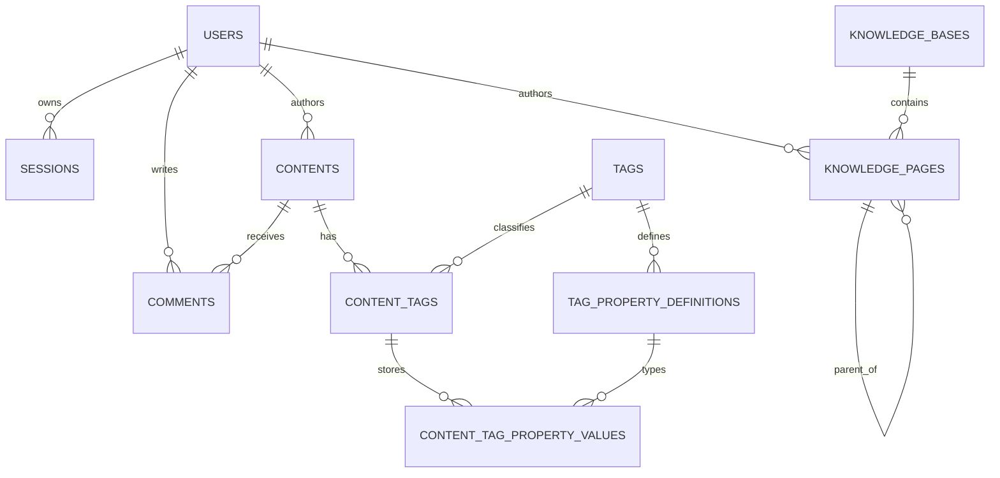

# Database and storage reference

## Relationship overview

## Table catalogue

### Publishing

| Table | Purpose | Important keys |
| --- | --- | --- |
| `contents` | Essays, thoughts, galleries, videos, ordinary pages | unique `slug`; indexes on status/publish time and visibility |
| `tags` | Reusable classifications and feature types | unique `slug` |
| `content_tags` | Many-to-many content/tag relation | unique `(content_id, tag_id)` |
| `tag_property_definitions` | Typed property schema for a tag | unique `(tag_id, key_name)` |
| `content_tag_property_values` | Values for one content/tag attachment | unique `(content_tag_id, definition_id)` |
| `comments` | Moderatable article comments; `user_id` is nullable for named guests | indexed `content_id`, `status`, `created_at` |

The footprint feature uses the publishing tables. `latitude`, `longitude`, and `location_name` are property definitions attached to the `footprint` tag.

### Knowledge

| Table | Purpose | Important keys |
| --- | --- | --- |
| `knowledge_bases` | One tutorial/manual/document collection; optional S3 `cover_url` | unique `slug`; ordered by `position` |
| `knowledge_pages` | An ordered page within one knowledge base | unique `(knowledge_base_id, slug)`; tree index `(knowledge_base_id, parent_id, position)` |

`knowledge_pages.parent_id` is an adjacency-list relationship. A null parent is a top-level chapter. `ON DELETE RESTRICT` prevents deleting a parent before its child pages are moved or removed. This keeps the document tree valid without encoding paths into slugs.

### Membership and media

| Table | Purpose | Important keys |
| --- | --- | --- |
| `users` | Member/editor/admin identity | unique email, role index |
| `sessions` | Hashed private browser sessions | unique token hash, expiry index |
| `media_objects` | Metadata for S3 objects | unique object key |
| `content_search` | Search projection for article/thought rows | primary key `content_id`; MySQL FULLTEXT index for title, summary, body text, and tags |

Binary bytes are not stored in MySQL. S3-compatible storage keeps media under immutable `YYYY/MM/{uuid}.{ext}` keys and documents under `contents/{id}/revisions/{revision}.md` or `knowledge/{id}/revisions/{revision}.md`; `media_objects` stores the matching media ID, object key, bucket, detected MIME type, original name, size, and timestamp. Upload is treated as a two-resource commit: after S3 succeeds, metadata is inserted; an insert failure triggers best-effort object deletion.

New article and knowledge-page Markdown is stored canonically in S3. `contents.body_markdown` and `knowledge_pages.body_markdown` remain as a legacy fallback for rows that have not been migrated. The four storage columns (`body_object_key`, `body_revision`, `body_hash`, `body_size`) let the Go service verify the object before returning it. Titles, summaries, visibility, publish state, hierarchy, comments, typed tag properties, and the normalized article search projection stay in MySQL. A media URL in Markdown references `/media/{object-key}` rather than embedding binary data in the article row.

## Migration policy

Migration files are embedded into the Go binary and run in order at startup. Every statement must be safe to run more than once. After a migration reaches a persistent environment, do not rewrite it; add a new numbered migration.

The current files are:

- `001_init.sql`: content, tags, typed properties, media metadata
- `002_membership.sql`: users and sessions
- `003_comments.sql`: comments
- `004_knowledge.sql`: knowledge bases and hierarchical pages
- `005_content_storage.sql`: article search projection; document object metadata is added idempotently by the startup schema guard for compatibility with already-created installations

`cover_url` is an additive compatibility column installed by the idempotent `ensureKnowledgeBaseCoverColumn` startup guard. The guard checks `information_schema` before altering an existing `knowledge_bases` table, which protects installations that already ran `004_knowledge.sql` without rewriting that deployed migration.

An installation created by an older build may still contain the unused `chat_messages` table. The application no longer reads or writes it. Remove that legacy table manually only after a backup if reclaiming it matters.

## Backups

- Back up MySQL with a consistent logical or physical snapshot.
- Back up the MinIO bucket and its versioning policy separately.
- Restore MySQL metadata and object storage together so stored URLs and object keys remain aligned.
- Before migrating old inline Markdown, take a backup and run `make content-verify`; migration is intentionally a separate command rather than an automatic startup side effect.
