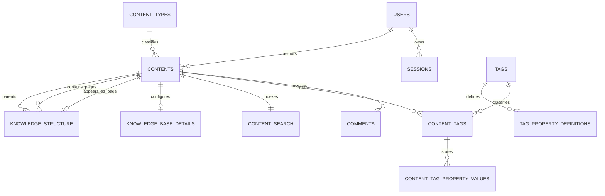

# Database and storage reference

## Persistence model

The CMS has one publication identity table: `contents`. Every article,
thought, gallery, video, standalone page, knowledge-base container, and
knowledge page begins as a row in that table. MySQL owns relationships,
permissions, lifecycle state, search, and ordering; S3-compatible storage owns
Markdown bytes and uploaded files.


```mermaid
erDiagram
  USERS ||--o{ SESSIONS : owns
  USERS ||--o{ CONTENTS : authors
  CONTENT_TYPES ||--o{ CONTENTS : classifies
  CONTENTS ||--o{ COMMENTS : receives
  CONTENTS ||--o{ CONTENT_TAGS : has
  TAGS ||--o{ CONTENT_TAGS : classifies
  TAGS ||--o{ TAG_PROPERTY_DEFINITIONS : defines
  CONTENT_TAGS ||--o{ CONTENT_TAG_PROPERTY_VALUES : stores
  CONTENTS ||--|| CONTENT_SEARCH : indexes
  CONTENTS ||--o| KNOWLEDGE_BASE_DETAILS : configures
  CONTENTS ||--o| KNOWLEDGE_STRUCTURE : appears_as_page
  CONTENTS ||--o{ KNOWLEDGE_STRUCTURE : contains_pages
  CONTENTS ||--o{ KNOWLEDGE_STRUCTURE : parents
```

## Tables

| Table | Purpose | Important keys |
| --- | --- | --- |
| `contents` | Common identity for every content type: author, title, summary, body-object metadata, status, visibility and timestamps | unique internal `slug`; indexes on type/status/visibility/published time |
| `content_types` | Registry of the system types and future extension metadata | `slug` primary key; renderer hint and description |
| `tags` | Reusable classifications and feature types | unique `slug` |
| `content_tags` | Many-to-many content/tag relation | unique `(content_id, tag_id)` |
| `tag_property_definitions` | Typed schema for each tag | unique `(tag_id, key_name)` |
| `content_tag_property_values` | Values on one content/tag attachment | unique `(content_tag_id, definition_id)` |
| `content_search` | Search projection for all indexable content, including `knowledge_page` | `content_id` primary key; FULLTEXT index |
| `knowledge_base_details` | Knowledge-base-only route slug, S3 cover URL and catalogue order | `content_id` primary key; unique `route_slug` |
| `knowledge_structure` | Knowledge-page-only base membership, parent relationship, route slug and sibling order | `content_id` primary key; unique `(knowledge_base_content_id, route_slug)` |
| `comments` | Moderatable content comments; guest `user_id` is null | content/status/time indexes |
| `users` | Member/editor/admin identity | unique email, role index |
| `sessions` | Hashed browser sessions | unique token hash, expiry index |
| `media_objects` | Metadata index for private S3 objects | unique object key, type/time indexes |

The system initially seeds these types:

```text
article, thought, gallery, video, page, knowledge_base, knowledge_page
```

`content_type` answers “what is this content?” and has one value. Tags answer
“what properties or classifications does it have?” and can have many values.
For example, a Tokyo article remains `article` and receives a `footprint` tag
whose typed properties are `latitude`, `longitude`, and `location_name`.

## Knowledge model

`knowledge_base` is a normal `contents` row with a matching
`knowledge_base_details` row. It is a collection container, so it normally has
an empty Markdown body. `knowledge_page` is also a normal `contents` row; its
matching `knowledge_structure` row declares which base contains it, its parent
page (or `NULL` for a root chapter), its user-facing route slug, and its order.

The parent relation is an adjacency list. `ON DELETE RESTRICT` prevents a page
with children from being removed accidentally. Deleting a base is a deliberate
collection operation: the repository removes its structure rows and page
content rows together in one transaction.

## Object storage

Binary bytes never enter MySQL. The default private bucket is `bc-content`:

```text
bc-content/
├── contents/{content-id}/revisions/000001.md
├── contents/{content-id}/revisions/000002.md
├── knowledge/{page-content-id}/revisions/000001.md
└── YYYY/MM/{uuid}.{ext}
```

Article, thought, gallery, video, page, and knowledge-page Markdown is
canonical in MinIO/S3. The `body_markdown` column remains only as a fallback
for an inline legacy row; new writes store `body_object_key`, `body_revision`,
`body_hash`, and `body_size` in MySQL and verify the object before returning
the Markdown. Titles, visibility, authorship, relations, and search stay in
MySQL. Media Markdown uses the same-origin `/media/{object-key}` route.

## Search and revisions

`content_search` is a derived projection, not a second canonical Markdown
copy. It holds title, summary, normalized text extracted from Markdown, and
tag/property text. The current API uses portable case-insensitive `LIKE`
matching; the included MySQL FULLTEXT index is available for a future
high-volume adapter. New or edited knowledge pages update this projection just
like articles.

Each document update writes a new immutable object revision before its MySQL
transaction commits. If the transaction fails, the newly written object is
deleted best-effort. Previous revisions are retained for a future history or
rollback UI.

## Migration and legacy knowledge tables

Migration SQL is embedded in the Go binary and idempotently applied at startup.
The current active schema is `001`, `002`, `003`, `005`, and `006`; migration
`006_unified_content.sql` creates the unified content-type and knowledge
extension tables. There is intentionally **no automatic migration** from the
former `knowledge_bases` / `knowledge_pages` tables, and the application no
longer reads or writes them.

That means an existing installation can retain those old tables harmlessly
while you recreate knowledge bases under the new model. They cannot contaminate
new reads or writes because no repository query references them.

After confirming you no longer need the former data, back up first and run the
explicit cleanup below manually:

```sql
-- Run from a MySQL client after a verified backup, never automatically.
DROP TABLE IF EXISTS knowledge_pages;
DROP TABLE IF EXISTS knowledge_bases;
```

Do not rewrite deployed migration files. Add a new numbered migration for any
future schema change.

## Backups

- Back up MySQL and the MinIO bucket as one logical recovery point.
- In All-in-One, the default host-mounted data roots are `/data/mysql` and
  `/data/minio`.
- A MySQL-only backup loses document/media bytes; an object-only backup loses
  titles, access rules, tags, tree relations, comments, and search metadata.
- Run `bc-content-storage -mode verify` after restore or before a planned
  migration.
